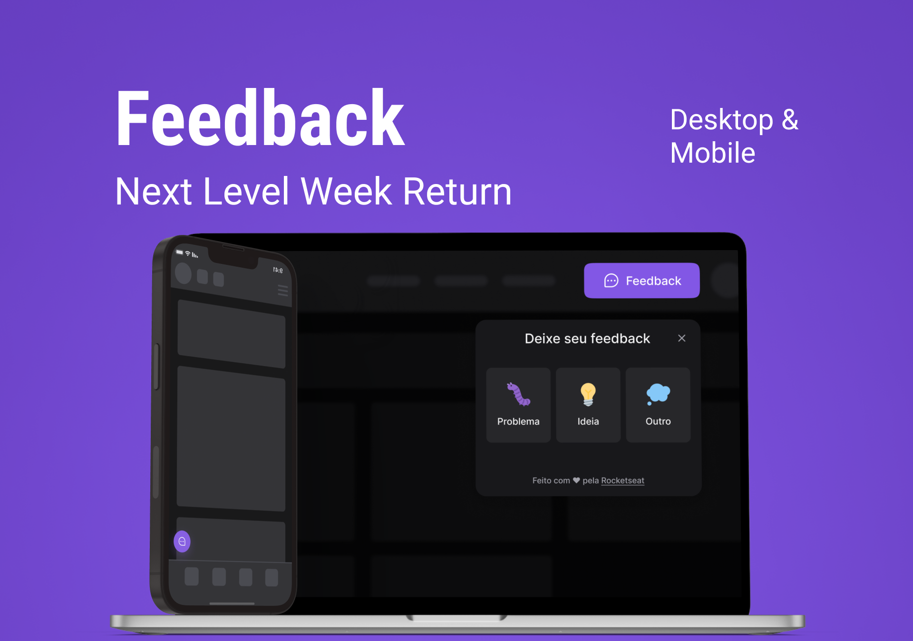

<h1 align="center">Feedback Widget</h1>

  
  
  
  

     

<!-- Atribuições-->
Projeto inicial Next Level Week #8, pela <a href="https://rocketseat.com.br/"><em>Rocketseat</em></a>

## 🧪 Tecnologias

Esse projeto foi desenvolvido com as seguintes tecnologias:
- [React](https://reactjs.org)
- [React Native](https://reactnative.dev/)
- [TypeScript](https://www.typescriptlang.org/)
- [Node](https://nodejs.dev/)
- [Tailwindcss](https://tailwindcss.com/)
- [Expo](https://expo.dev/)
- [Vite](https://vitejs.dev/)
- [Express](https://expressjs.com/)
- [Prisma](https://www.prisma.io/)

## 💻 Projeto

[Feedget](https://feedget-igorcbraz.vercel.app/) é uma aplicação completa, desenvolvida para ambientes mobile e web. Com objetivo de reportar feedbacks para diveras aplicações por meio de seu widget interativo ao usuário.

Este é um projeto inicialmente desenvolvido na **[Next Level Week (NLW)](https://lp.rocketseat.com.br/nlw-return)**, feito pela Rocketseat.
Após o término do curso o projeto foi e está sendo continuado e desenvolvido, seguindo os seguintes ajustes e melhorias.

## 📐 Ajustes e Melhorias 🔍
As seguintes funcionalidades foram feitas além do _NLW_:

- [ ] Tema light e dark
- [ ] Melhorar sistema de envio dos emails e layout
- [ ] Dashboard de feedbacks
- [ ] Autenticação com github
- [ ] Validação de campos e erros
- [ ] Landing Page

## 🔖 Layout
Você pode acessar o design inicial deesse projeto pelo link abaixo:

- [Layout no Figma](https://www.figma.com/community/file/1102912516166573468)

> Lembrando que é necessário ter uma conta no [Figma](https://www.figma.com/login?cont=/developers) para acessar o projeto
